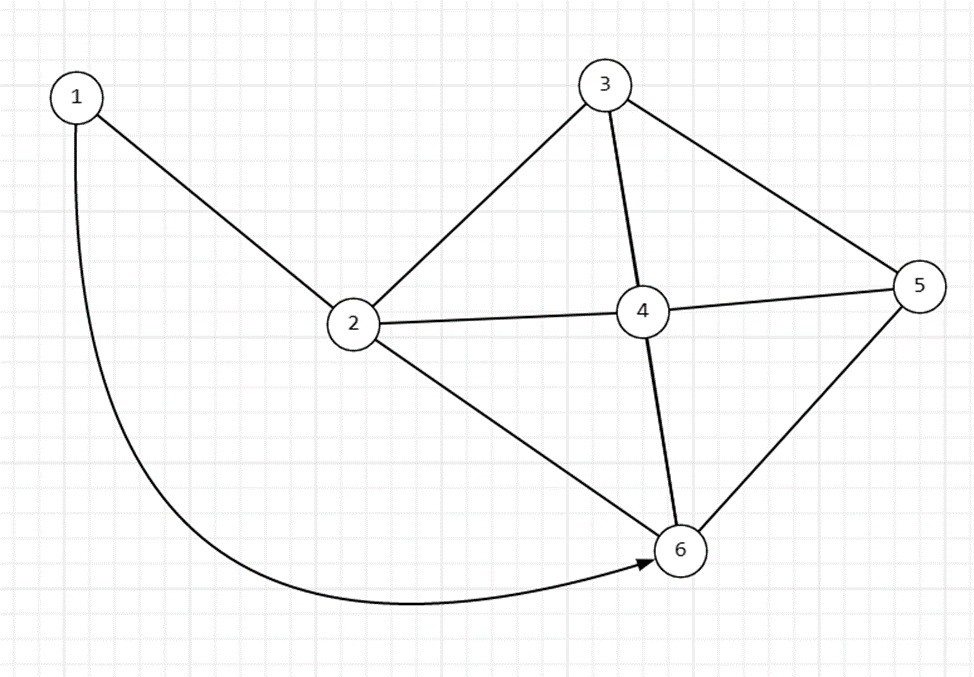

# Задача поиск кратчайшего пути.

## Backend
Тестовое задание.
Создать граф вывести в Лог (log)  (текстовый файл).
Задача из вершины 1 найти кратчайший путь к вершине 6. решение код src/graph_shortest_path.py

## Решение задачи
Данный код реализует поиск кратчайшего пути в графе с помощью алгоритма обхода в ширину (BFS). Программа строит граф на основе предоставленной строки, где каждая вершина представлена числом, за которым следует список соседей через запятую. Затем осуществляется поиск кратчайшего пути между заданными вершинами.

### Методы 
- build_graph(graph_str) -
Метод build_graph преобразует строку, представляющую граф, в словарь, где ключами являются вершины, а значениями - списки их соседей.

- bfs_shortest_path(graph, start, end) -
Метод bfs_shortest_path выполняет поиск кратчайшего пути в графе с помощью алгоритма обхода в ширину (BFS). Принимает на вход словарь graph, представляющий граф, и вершины start и end, между которыми осуществляется поиск пути. Возвращает кратчайший путь в виде списка вершин.

# Задача парсинг данных(Python-playwright)
1. Страница https://www.python.org/downloads/ - спарсить таблицу «Python releases by version number» с заголовками «Release version», «Release date», «Download»(полная ссылка), «Release Notes»(полная ссылка);
2. Формат выходного файла - данные должны сохраняться в формате .xlsx
